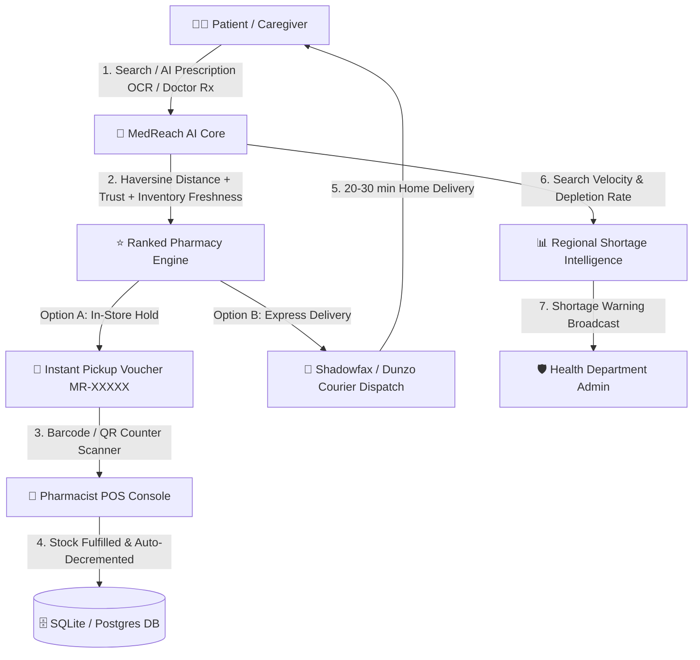

<div align="center">

# 🏥 MedReach AI
### *National Healthcare Emergency Medicine & Pharmacy Network*

[](https://nextjs.org)
[](https://fastapi.tiangolo.com)
[](https://docs.pytest.org)
[](https://web.dev/progressive-web-apps/)
[](LICENSE)

**Find the right medicine. Find it nearby. Save valuable time.**

[🌐 View Features](#-key-functional-pillars) • [🚀 Quick Start](#-installation--running-locally) • [🔑 Demo Credentials](#-1-click-demo-credentials) • [📡 API Docs](#-api-reference-overview)

---

</div>

## 🎯 Executive Summary & Mission

In acute medical emergencies, patients and caregivers lose precious hours physically hopping between pharmacies only to discover required medicines are out of stock. **MedReach AI** is an intelligent healthcare logistics platform that routes patients directly to verified local pharmacies with available stock in real time.

It pairs **3D Live WebGL Interactions**, **AI Prescription OCR**, **Multi-Factor Pharmacy Ranking (Haversine + Inventory Freshness)**, **1-Click Counter Reservations**, **Doctor Digital E-Prescription Gateways**, **Express Delivery Couriers**, and **Regional Shortage Intelligence** into a unified ecosystem.

> [!IMPORTANT]
> **Zero Delays in Emergency**: MedReach AI provides an offline-resilient PWA service worker (`sw.js`) that caches emergency hotlines (`108` Ambulance, `112` Emergency) and 24/7 night pharmacy directories even when internet connectivity drops.

---

## 🔑 1-Click Demo Credentials

To experience MedReach AI without setup friction, built-in demo accounts are provided for all three major platform personas:

| Role | Email | Password | Primary Capabilities |
| :--- | :--- | :--- | :--- |
| 🧑‍⚕️ **Patient** | `patient@medreach.ai` | `password123` | Medicine search, AI OCR upload, Stock holds, Delivery quote |
| 💊 **Pharmacist** | `pharmacist@medreach.ai` | `password123` | Stock manager, POS CSV sync, QR counter scanner |
| 🛡️ **Admin / Health Officer** | `admin@medreach.ai` | `password123` | Regional shortage forecasting, Pharmacy verification |

---

## ⚡ Problem vs. MedReach Solution

```
┌─────────────────────────────────────────────────────────┐
│                 TRADITIONAL EXPERIENCE                  │
├─────────────────────────────────────────────────────────┤
│ ❌ Store-hopping during emergencies (2-3 hours lost)     │
│ ❌ Opaque stock & arbitrary counter markup prices      │
│ ❌ Counterfeit / Unverified medicine risk               │
│ ❌ Regional supply shortages detected too late           │
└─────────────────────────────────────────────────────────┘
                            ▼
┌─────────────────────────────────────────────────────────┐
│                    MEDREACH AI WAY                      │
├─────────────────────────────────────────────────────────┤
│ ✅ Real-time inventory routing & GPS Haversine distance │
│ ✅ Up to 70% savings via Bioequivalent Generic Matcher  │
│ ✅ 1-Click stock holds with instant QR pickup voucher   │
│ ✅ Predictive Shortage Analytics for Health Authorities │
└─────────────────────────────────────────────────────────┘
```

---

## 🌟 Architecture & Data Flow



---

## 🚀 Key Functional Pillars

### 1. 🔍 Patient Medicine Discovery & Booking
* **Smart Autocomplete & Category Carousels**: Real-time debounced search across verified active drug databases (`Paracetamol`, `ORS`, `Azithromycin`, `Insulin`, `Telmisartan`).
* **AI Prescription Scanner**: Upload handwritten or printed prescription images $\rightarrow$ OCR extraction $\rightarrow$ confidence scoring $\rightarrow$ explicit patient verification.
* **Doctor Digital E-Prescription Gateway**: Direct push from hospital clinics with verified MCI licenses (*MCI-482910-MH*) and diagnostic schedules (`1-0-1 after food`).
* **Multi-Item Prescription Basket Matcher**: Finds single-store fulfillment for complex multi-drug prescriptions at lowest aggregate cost.
* **Generic Bioequivalent Matcher**: Suggests verified cheaper substitute drugs with identical active pharmaceutical ingredients (API) and dosage, saving up to 70%.
* **WhatsApp & SMS Deep Link Integration**: 1-click transmission of pickup voucher codes, store address, items list, and Google Maps GPS navigation.
* **Express Home Delivery**: Toggle between FREE In-Store Pickup and ₹39 Express Courier Delivery (20–30 mins).

### 2. 💊 Pharmacist Inventory & POS Console
* **Live Inventory Manager**: Real-time batch numbers, expiration dates, unit pricing, and quantity adjustments.
* **Counter QR / Barcode Scanner**: Verify patient pickup codes (`MR-82914`) and auto-decrement stock with 1 click.
* **Bulk CSV Import / Export**: Instant POS inventory synchronizer with downloadable sample template and column mapping (Marg, Vyapar, Pharmasoft compatible).
* **Incoming Reservation Queue**: Accept & Hold or Reject incoming medicine requests with instant real-time patient notifications.

### 3. 📊 Regional Shortage Intelligence & Health Admin
* **Predictive Shortage Engine**: Categorizes regional supply zones into `LOW`, `MEDIUM`, and `HIGH` shortage risks based on search velocity surges and stock depletion rates.
* **Interactive Demand Charts**: Visual 7-day demand trend lines and pharmacy activity bar charts powered by Recharts.
* **Pharmacy Network Verifier**: 1-click licensing verification status controls for partner stores.

### 4. ⚡ Offline Progressive Web App (PWA)
* **Service Worker (`public/sw.js`)**: Network-first caching with offline fallback.
* **Offline Emergency Banner**: Automatic offline detection displaying cached 24/7 pharmacies, 108 (Ambulance), and 112 (Emergency Response) hotlines.

---

## 🔒 Security & Data Integrity Model

> [!NOTE]
> MedReach AI implements strict security controls to protect patient health data and prevent API abuse.

| Security Layer | Technical Implementation Details |
| :--- | :--- |
| **Password Encryption** | Bcrypt with salt generation via Passlib (`bcrypt.hash`) |
| **Authentication** | Stateless JWT tokens (HMAC-SHA256) with role validation (`PATIENT`, `PHARMACIST`, `ADMIN`) |
| **SQL Injection Prevention** | Full ORM abstraction using SQLAlchemy with parameterized statements |
| **Cross-Site Scripting (XSS)** | React JSX auto-escaping + Pydantic v2 strict input sanitization |
| **CORS & Headers** | Restricted API router endpoints with explicit HTTP method whitelisting |
| **Data Integrity** | Foreign key enforcement, unique reservation codes (`MR-XXXXX`), and transaction rollbacks |

---

## 🏗️ Technology Stack

```
 MedReach AI Tech Stack
 ├── Frontend (Next.js 14 App Router)
 │   ├── Framework: Next.js 14.2, React 18, TypeScript
 │   ├── Styling: Vanilla CSS + Tailwind CSS (Custom Dark Glassmorphic Theme)
 │   ├── 3D Canvas: Three.js, @react-three/fiber, @react-three/drei
 │   ├── Animations & Icons: Framer Motion, Lucide React
 │   └── Data Visualization: Recharts
 │
 └── Backend (FastAPI Python Service)
     ├── API Framework: FastAPI 0.110+, Pydantic v2, Uvicorn
     ├── Database & ORM: SQLAlchemy 2.0, SQLite 3 / PostgreSQL
     ├── Auth & Security: Passlib (Bcrypt), Python-JOSE (JWT)
     └── Testing: Pytest (12/12 test cases passing)
```

---

## 💻 Repository Structure

```
Medreach-ai/
├── backend/
│   ├── app/
│   │   ├── main.py                # FastAPI app initialization & CORS setup
│   │   ├── config.py              # Environment configuration & JWT keys
│   │   ├── database.py            # SQLAlchemy engine & session manager
│   │   ├── models.py              # Relational database models
│   │   ├── schemas.py             # Pydantic validation schemas
│   │   ├── seed.py                # Database seeder with realistic demo data
│   │   ├── deps.py                # Auth dependency injection & role guard
│   │   ├── routers/               # Modular API endpoint routers
│   │   └── services/              # Haversine ranking & AI OCR services
│   ├── scripts/                   # Point-in-time backup & restore scripts
│   ├── tests/                     # Pytest suite (12/12 passed)
│   └── requirements.txt           # Python dependencies
│
└── frontend/
    ├── src/
    │   ├── app/                   # Next.js 14 App Router pages
    │   │   ├── page.tsx           # Home landing page with 3D canvas
    │   │   ├── patient/page.tsx   # Patient search & booking console
    │   │   ├── pharmacist/page.tsx# Chemist POS & stock console
    │   │   └── admin/page.tsx     # Shortage intelligence dashboard
    │   ├── components/            # Reusable UI & modal components
    │   ├── lib/                   # API client layer & auth provider
    │   └── types/                 # TypeScript interfaces
    ├── public/
    │   ├── sw.js                  # PWA offline emergency service worker
    │   └── manifest.json          # Web app manifest
    └── package.json
```

---

## 🚀 Installation & Running Locally

### Prerequisites
* **Node.js**: `v18.17+` or `v20+`
* **Python**: `v3.10+` or `v3.11+`
* **Git**

### 1. Backend Setup (FastAPI)

```bash
cd backend

# Create virtual environment
python -m venv .venv

# Activate environment
# Windows:
.\.venv\Scripts\activate
# Linux/macOS:
source .venv/bin/activate

# Install requirements
pip install -r requirements.txt

# Start FastAPI server
python -m uvicorn app.main:app --host 127.0.0.1 --port 8000 --reload
```

> **API Documentation & Swagger UI**: Available at `http://127.0.0.1:8000/docs`

### 2. Frontend Setup (Next.js 14)

```bash
cd ../frontend

# Install dependencies
npm install

# Start development server
npm run dev

# Or build for production
npm run build
npm run start
```

> **Web Application**: Available at `http://localhost:3000`

---

## 🧪 Automated Test Verification

### Run Backend Unit & Integration Tests
```bash
cd backend
.\.venv\Scripts\python.exe -m pytest
```
```text
====================== 12 passed in 4.27s ======================
```

### Run Frontend Production Build & Typecheck
```bash
cd frontend
npm run build
```
```text
✓ Compiled successfully
✓ Generating static pages (9/9)
```

---

## 💾 Point-in-Time Database Backup & Recovery

### Create Instant Snapshot
```bash
cd backend
.\.venv\Scripts\python.exe scripts/backup_db.py
```
> *Creates integrity-checked SQLite snapshot in `backend/backups/medreach_backup_YYYYMMDD_HHMMSS.db`.*

### Restore Latest Snapshot
```bash
cd backend
.\.venv\Scripts\python.exe scripts/restore_db.py
```
> *Restores snapshot with automated pre-restore safety check and `PRAGMA integrity_check` verification.*

---

## 📡 API Reference Overview

| Method | Endpoint | Description | Auth Required |
| :--- | :--- | :--- | :---: |
| `POST` | `/api/auth/login` | Authenticate user & issue JWT bearer token | No |
| `POST` | `/api/auth/register` | Register new patient, pharmacist, or admin account | No |
| `GET` | `/api/medicines/search` | Search medicine catalog by name/generic | No |
| `GET` | `/api/medicines/{id}/substitutes` | Retrieve generic bioequivalent alternatives | No |
| `GET` | `/api/pharmacies/nearby` | Haversine GPS smart-ranked pharmacies search | No |
| `POST` | `/api/pharmacies/basket-availability` | Multi-item prescription basket availability matcher | No |
| `POST` | `/api/prescriptions/upload` | AI OCR extraction from prescription image | Yes |
| `POST` | `/api/prescriptions/doctor-push` | Doctor clinic digital e-prescription push | No |
| `GET` | `/api/prescriptions/inbox/my` | Patient digital prescription inbox | Yes |
| `POST` | `/api/reservations` | Create 1-click hold reservation | Yes |
| `GET` | `/api/reservations/my` | List active patient stock holds | Yes |
| `GET` | `/api/reservations/{id}/whatsapp-link` | Pre-formatted WhatsApp & SMS voucher payload | Yes |
| `POST` | `/api/reservations/delivery/quote` | Calculate courier delivery ETA & fee | No |
| `POST` | `/api/pharmacies/{id}/inventory/import-csv` | Bulk import inventory from POS CSV | Yes (Pharmacist) |
| `GET` | `/api/analytics/admin-stats` | Executive supply stats & shortage predictions | Yes (Admin) |

---

## 📄 License & Medical Disclaimer

**License**: Distributed under the MIT License. See `LICENSE` for details.

> [!CAUTION]
> **Medical Disclaimer**: Information provided by MedReach AI is intended exclusively for inventory routing and verified pharmacy discovery. It does not constitute medical diagnosis, prescription, or clinical advice. Always consult a licensed healthcare practitioner for medical emergencies.
